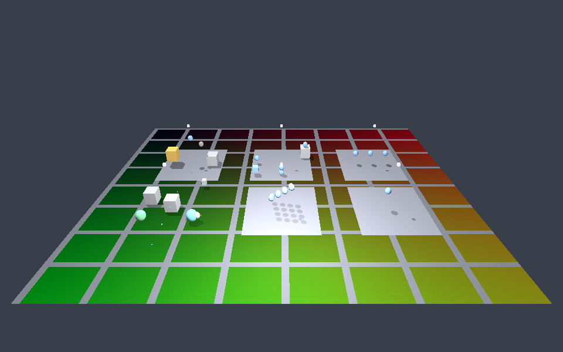

# Axiom Physics Crucible

A rendered, deterministic **physics proving room**. The crucible is a hostile
engine test chamber: it drives the `axiom-physics` engine module through its
public `PhysicsApi` facade across six scripted stations, exercises as much of the
physics surface as the facade exposes, translates every physics snapshot into
renderable debug geometry, and runs a hidden replay world in lock-step so that
*determinism is a visible property*.



*(Real GPU render of the room pre-simulated to the hero step — see "How it
renders" below.)*

## The six stations

| # | Station | What it proves |
|---|---------|----------------|
| 1 | **Body Bay** | The four facade body states — static, dynamic, kinematic, and *disabled* — behave distinctly. The dynamic sphere falls and settles; the static and kinematic boxes never move; the disabled body holds its position despite gravity. |
| 2 | **Contact Bay** | The four narrow-phase pair types the module generates — sphere/plane, sphere/sphere, sphere/box, box/plane — produce contacts that are solved (bodies rest instead of tunnelling), with honest broad/narrow/solve counts. |
| 3 | **Material Bay** | A restitution ladder (`0.0 / 0.5 / 0.9`): a bouncy body rebounds, an inelastic one does not, and rebound speed orders with restitution. A mass test proves `Δv = impulse · inverse_mass`. |
| 4 | **Query Bay** | Exact spatial queries: a raycast hits a solid box, misses into empty space, and passes *through* a trigger to the solid body behind it; an overlap-sphere probe reports membership. |
| 5 | **Stress Bay** | A deterministic 4×4 sphere pile dropped onto a floor: the `O(n²)` broad phase, the contact solver, and substepping under load — and byte-identical replay of the same drop. No body tunnels the floor. |
| 6 | **Replay Bay** | The two-world determinism proof: the visible and hidden replay worlds receive byte-identical inputs and stay in perfect sync, and a deliberate perturbation in the replay world is *detected*. |

## Running it

**Headless report** (deterministic, no renderer):

```sh
cargo run -p axiom-physics-crucible
```

This builds the full crucible, runs every station's scripted scenario to
completion, and prints the structured `CrucibleReport` — every count `PhysicsApi`
exposes, the replay-match flag, the query-hit tally, and the honestly-marked
fields physics does not yet surface.

**Rendered frame** (via the headless screenshot tool):

```sh
cargo run --manifest-path tools/axiom-shot/Cargo.toml --release -- \
  --app physics-crucible --backend gpu --out crucible.png
# or the software backend:
#   --backend canvas2d
```

**In the browser** (the demo gallery): this crate is also a browser/WASM app, and
there the physics runs **live** — bodies fall, bounce, and pile in real time while
the camera orbits. Its wasm arm (`src/web.rs`) drives the `axiom-windowing` render
loop itself and, each frame, steps the physics world and re-authors the scene
(`RunningApp::reauthor`) so the new body transforms render — the same technique the
DOOM browser app uses for live game logic. It is interactive: **▲ / Space / K**
kick every dynamic body upward so the pile scatters and re-settles; **▼ / R** reset
and re-drop. The room also loops on its own. Registered as the `physics-crucible`
demo in `gallery/gallery.js` and `scripts/package_gallery.py`:

```sh
make gallery-fast      # package every demo (wasm) and serve at http://localhost:8000
```

It renders through WebGPU, falling back to WebGL2 / the software Canvas2D backend
(`?backend=canvas2d`) when no GPU is available.

## How it renders (the live loop, and the one static path)

The crucible renders **live** in the browser, and as a **static frame** for the
native screenshot tool. The difference is which loop drives it:

- **Live (browser, `src/web.rs`).** The wasm arm owns the render loop directly via
  `axiom-windowing` (it does not call `App::run`). Each frame it steps the physics
  world one tick and calls `RunningApp::reauthor` to re-author the scene from the
  new body transforms, then renders — so the simulation plays out on screen and the
  camera orbits. This is the same pattern the DOOM browser app uses to drive live
  game logic each frame. Input (kick / reset) is read off the keyboard/keypad.

- **Static (native screenshot, `build_physics_crucible`).** The `axiom-shot` tool
  ticks a *built* `RunningApp` and reads back one frame's draw data; it has no place
  to step external physics between frames. So that path **pre-simulates** the room
  deterministically to a "hero" step (`HERO_STEP`) and renders one settled frame — a
  faithful *still of a real simulation*, used only for the headless screenshot.

Two facade realities are worth recording, because they shaped the design (not
because they block the live demo):

1. **`App::run` exposes no per-frame external hook** — which is exactly why the live
   arm drives `axiom-windowing` itself instead of calling `App::run`.
2. **`PhysicsApi` exposes no teleport / `set_transform`** — bodies move only by
   forces/impulses/gravity, so a *scripted* kinematic platform path is not
   achievable through the facade (the testable kinematic property is "ignores
   gravity", which the Body Bay proves). The kick interaction therefore uses
   `apply_impulse`, which the facade does expose.

Per-step motion, contacts, queries, restitution, and replay are also proven
headlessly by `run_report` and the test suite, which step physics live.

## Physics API gaps discovered

Building the crucible surfaced exactly what the facade does and does not offer:

- **No `set_transform` / teleport.** Bodies can only be placed at creation and then
  moved by forces/impulses/gravity. This is why kinematic platforms can't be
  scripted through the facade (see above).
- **Kinematic bodies do not integrate from velocity.** They ignore gravity and stay
  put; there is no facade call to give them a scripted path.
- **Capsule contacts are not generated.** `attach_capsule_collider` works and a
  capsule body renders, but it has no resting contact, so the crucible never relies
  on one (the Body Bay creates a capsule only to prove the attach path; queries
  exclude capsules by documented design).
- **No collision/trigger lifecycle events.** The event log is lifecycle-only
  (create/attach/enable/disable/step), so the report marks `collision_events:
  unavailable`. Triggers are honoured by *queries* (overlap includes them, raycast
  excludes them) but emit no enter/exit events.
- **No angular dynamics, no friction impulse.** Angular velocity/torque and material
  friction are stored and validated but not integrated/solved; the report marks both
  `unavailable`.
- **`solver_iteration_count` is a configured budget, not work done.** The report
  labels it as such and uses `solved_contact_count` for real solver work.

All of these are genuine, documented deferrals in `modules/axiom-physics`
(`LEGITIMACY_AUDIT.md` / `ROADMAP.md`), not crucible shortcomings — the crucible's
job is to exercise and *honestly report* the real surface.

## Architecture

See [`ARCHITECTURE.md`](ARCHITECTURE.md). In short: physics and the renderer are
isolated modules, and **this app owns every boundary between them**. Physics never
imports a renderer type; the renderer never imports a physics type. Because
`axiom-physics` exposes a single facade, its internal snapshot/record/contact types
are unnameable here, so the app projects them into its own value types at one
chokepoint (`CrucibleWorld`).
