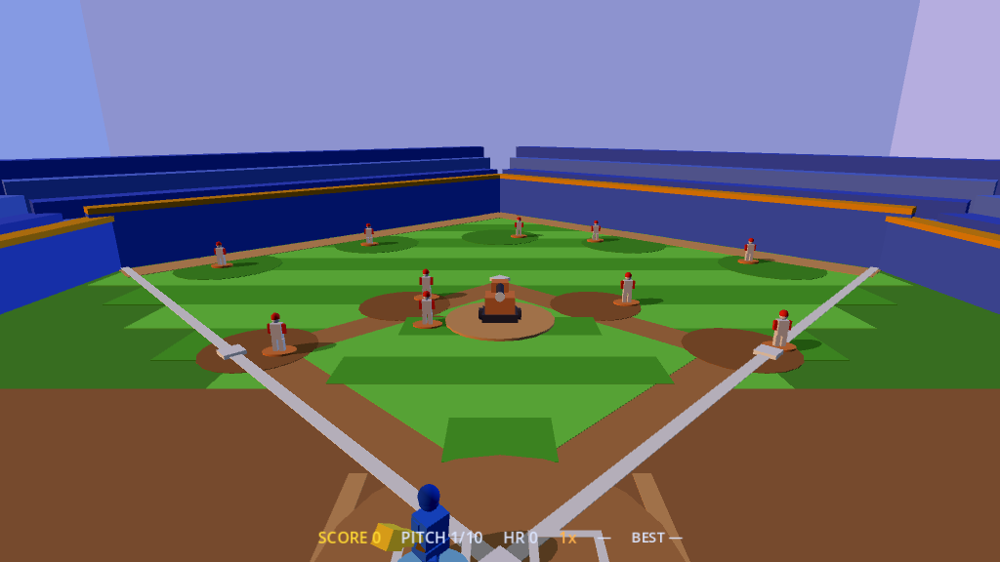

# Home Run! — GDScript / Godot 4 port

A faithful port of Axiom's pure-TypeScript **Home Run!** app
(`apps/axiom-home-run`) to **GDScript on Godot 4.6**. Same toy-tabletop diamond,
same always-armed swing, same deterministic seeded pitch sequence, same home-run
cinematic — rebuilt on Godot's node/renderer instead of `@axiom/web-engine`.

This is an experiment in retargeting an Axiom app onto a different engine. It is
**not** part of the Axiom engine graph (not a layer/module/app/tool, not a Cargo
package) — it lives under `ports/` and is ignored by the architecture checker and
the coverage gate.



## Why the port is clean

The original is already structured as **pure logic + declarative rendering**, so
almost nothing had to be reinvented:

- The whole gameplay core (`vec`/`hash`, `constants`, `pitch`, `swing`,
  `swing-outcome`, `ball`, `fielders`, `cinematic`, and the `session` state
  machine) is engine-free arithmetic driven by a deterministic integer hash. It
  ports to GDScript almost line-for-line.
- `view.ts` describes the entire stadium every frame as a flat list of keyed
  `box`/`sphere`/`cylinder` instances with named materials — which maps **1:1**
  onto Godot `MeshInstance3D` + `StandardMaterial3D`. `game.gd` reconciles that
  list into nodes (spawn / re-pose / despawn), exactly as the web engine's
  reconciler did.

`hash01` is reproduced bit-for-bit (JS `Math.imul` + unsigned shifts emulated
with 32-bit masking), so **a given seed produces the same round as the
TypeScript original**.

## Structure

```
project.godot          # Godot 4.6 project (gl_compatibility renderer)
main.tscn              # a single Node3D running scripts/game.gd
scripts/
  math_util.gd   (HRMath)         # hash01, euler->quaternion, scalar helpers
  constants.gd   (HRC)            # every tuning number
  cinematic_constants.gd (HRCine) # the home-run cinematic tuning object
  pitch.gd       (HRPitch)        # seeded pitch selection + solve
  swing.gd       (HRSwing)        # swing state machine + swept contact
  swing_outcome.gd (HRSwingOutcome) # authoritative deterministic hit prediction
  ball.gd        (HRBall)         # in-play flight, boundaries, scoring
  fielders.gd    (HRFielders)     # seeded wander + chase/catch
  cinematic.gd / cinematic_camera.gd  # the home-run cinematic director
  session.gd     (HomeRunSession) # the round state machine (the heart)
  view.gd        (HRView)         # pure scene-of-instances builder (was view.ts)
  materials.gd   (HRMaterials)    # the material palette
  game.gd        # the Godot host: loop, input, reconciler, camera, lights, HUD, audio
```

Records that were TypeScript object literals are GDScript `Dictionary` values
(a lightweight, source-faithful choice for this data-transform-heavy port);
vectors are `Vector3`, rotations are `Quaternion`.

## Controls

- **A / D** (or **←/→**) — shift the batter in the box
- **SPACE** — swing (also starts the round); the bat re-winds on its own (cooldown)
- **ENTER** — restart once the round is over

## Run

Open `project.godot` in Godot 4.6+, or from the CLI:

```sh
godot --path .                      # play
```

### Deterministic screenshot

Pass args after `--` to capture one frame and quit
(`shot <frame> [out.png] [seed] [swingAt]`):

```sh
godot --path . --rendering-driver opengl3 --resolution 1024x700 \
  -- shot 70 shot.png 1 -1
```

## Fidelity notes

- The renderer is set to `gl_compatibility` for portability. Lighting is the
  data-driven moving sun + a fill light (the same values the original computed);
  the game bakes its own translucent ground-shadow ellipses, so Godot's real-time
  shadows are left off, exactly as in the original.
- Godot gamma-brightens midtones relative to the original's flatter Lambert, so a
  small ambient reduction + brightness/contrast trim in the `WorldEnvironment`
  brings the toy palette back toward the original's dusk mood.
